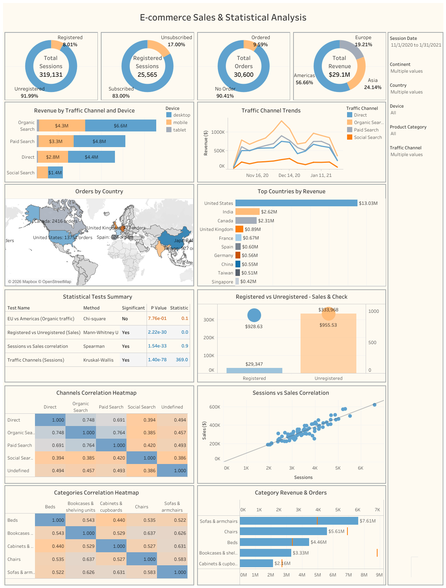

# E-Commerce Sales and Statistical Analysis

Python data analysis project built using Google Colab and Google BigQuery.

## Description

Analyzes e-commerce sales, customer behavior, traffic sources, and product performance using Python, SQL, statistical methods, and Tableau.

## Analysis

- Data extraction from Google BigQuery
- Data overview
- Data cleaning
- Sales analysis
- Product category analysis
- Country and continent analysis
- Traffic source analysis
- Device analysis
- Registered user analysis
- Email subscription analysis
- Sales trends
- Pivot tables
- Correlation analysis
- Statistical hypothesis testing

## Tools

- Python
- SQL
- Google BigQuery
- Pandas
- NumPy
- Matplotlib
- Seaborn
- SciPy
- Google Colab
- Tableau Public

## Dashboard

[Open in Tableau Public](https://public.tableau.com/app/profile/volodymyr.tsapko/viz/E-commerceSalesStatisticalAnalysis_17872140061880/Dashboard)

## Notebook

[ecommerce_sales_statistical_analysis.ipynb](ecommerce_sales_statistical_analysis.ipynb)
