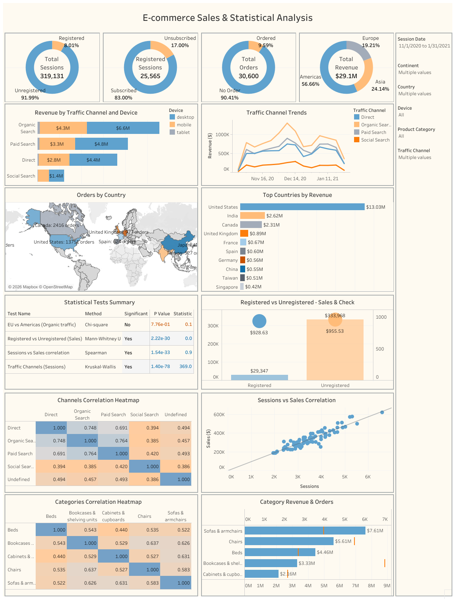

# E-Commerce Sales and Statistical Analysis

Python data analysis project built using Google Colab and Google BigQuery.

## Description

Analyzes e-commerce sales, customer activity, traffic sources, devices, email engagement, and statistical relationships using Python, SQL, and Tableau.

## Dataset

* Source: Google BigQuery
* Dataset: `data-analytics-mate.DA`

## Analysis

- Sales performance
- Orders
- Product categories
- Countries and continents
- Traffic sources and channels
- Device types and models
- Registered users
- Email confirmation and newsletter subscriptions
- Sales trends
- Statistical analysis

## Tools

- Python
- SQL
- Google BigQuery
- NumPy
- Pandas
- Matplotlib
- Seaborn
- Google Colab
- Tableau Public

## Dashboard

[Open in Tableau Public](https://public.tableau.com/app/profile/volodymyr.tsapko/viz/E-commerceSalesStatisticalAnalysis_17872140061880/Dashboard)

## Notebook

[ecommerce_sales_statistical_analysis.ipynb](ecommerce_sales_statistical_analysis.ipynb)
