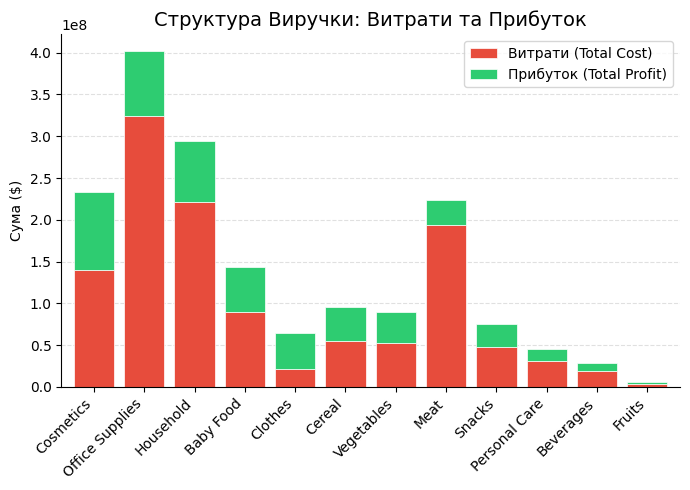

# Global Retail Sales Analytics

Python data analysis project built using Google Colab.

## Description

Performs data cleaning, exploratory data analysis (EDA), and visualization of a global retail sales dataset using Python.

## Analysis

- Data overview
- Data cleaning
- Sales analysis
- Profit analysis
- Product category analysis
- Country and region analysis
- Sales channel analysis
- Shipping time analysis
- Sales trends over time
- Sales by day of week

## Tools

- Python
- Pandas
- NumPy
- Matplotlib
- Seaborn
- Google Colab

## Visualizations

## Python Notebook

[global_retail_sales_analytics.ipynb](global_retail_sales_analytics.ipynb)
