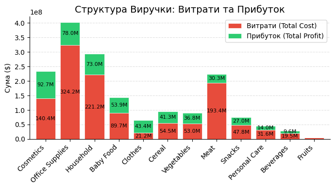
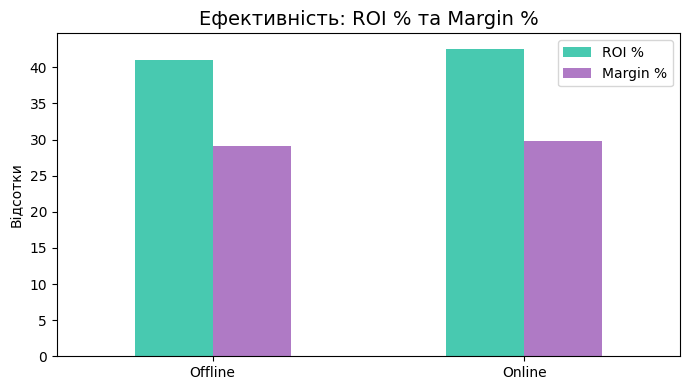
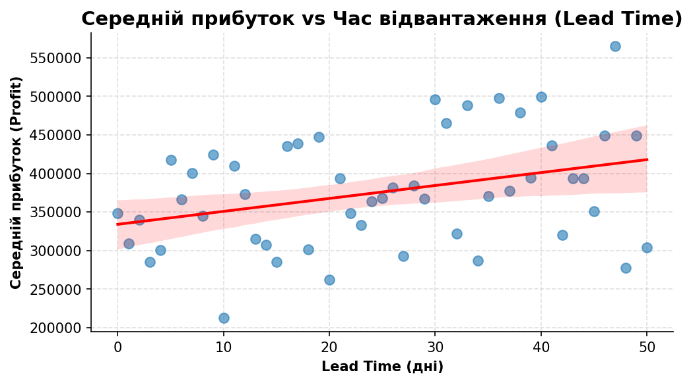
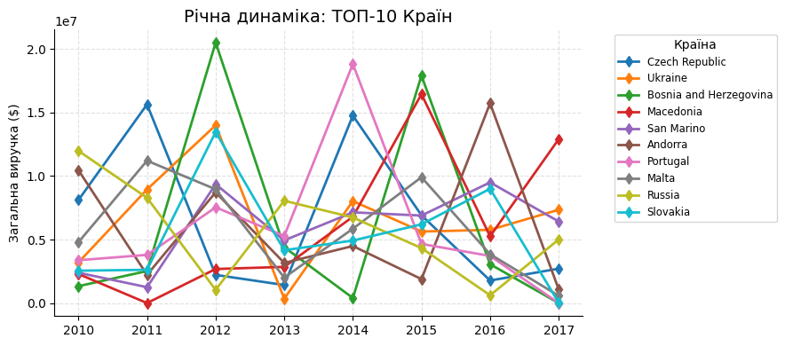
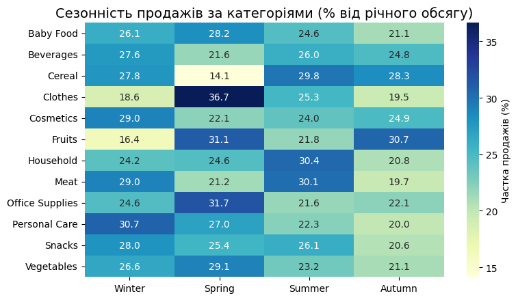

# Global Retail Sales Analytics

Python data analysis project built using Google Colab.

## Description

Performs data cleaning, exploratory data analysis (EDA), and data visualization on a global retail sales dataset using Python.

## Dataset

* `events.csv`
* `products.csv`
* `countries.csv`

## Analysis

- Data overview
- Data cleaning
- Sales
- Profit
- Product category
- Country and region
- Sales channel
- Shipping lead time
- Sales trends over time
- Sales by day of week

## Tools

- Python
- Pandas
- NumPy
- Matplotlib
- Seaborn
- Google Colab

## Visualizations

## Notebook

[global_retail_sales_analytics.ipynb](global_retail_sales_analytics.ipynb)
